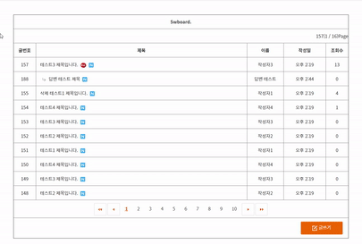

# 댓글 게시판(reply Bulletin Board System) - 개인 프로젝트 

## 목적
- 신입 웹 개발자의 기본소양
- 어떠한 웹이던지 게시판은 필수요소
- 반복된 연습으로 빠르고 최적화된 게시판 생성을 목표로함
--------------------------------------------------------

## 개발환경
- Spring 3.9
- JDK 11.0
- oracle 12.1
- Mybatis 3.2
- Tomcat 8
- ---------------------------------------------------------------------------
## swboard 패키지 구조

----------------------------------------------------------------------------
## sw 데이터베이스 모델링

----------------------------------------------------------------------------
## 메인 화면

## 메인 베너

## 메인 주요서비스

----------------------------------------------------------------------------
##주요 기능
- 게시판 페이징 
~~~c
public class SwboardList {

	private ArrayList<SwboardVO> list = new ArrayList<SwboardVO>();
	private int pageSize = 10;	// 화면 하단에 보여지는 페이지의 개수
	private int totalCount = 0;	// 전체 게시글 수 
	private int totalPage = 0;	// 전체 페이지 수
	private int currentPage = 1;	// 현재 페이지
	private int startNo= 0;		// 게시글 시작 번호
	private int endNo= 0;		// 게시글 끝 번호
	private int startPage= 0;	// 게시글 번호에 따라 보여지는 페이지의 시작 번호
	private int endPage= 0;		// 게시글 번호에 따라 보여지는 페이지의 마지막 번호

	public SwboardList() { }
	
//	페이지 작업에 사용할 8개의 변수를 초기화 시키는 메소드
	public void initSwboardList(int pageSize, int totalCount, int currentPage) {
		this.pageSize = pageSize;
		this.totalCount = totalCount;
		this.currentPage = currentPage;
		calculator();
	}

	private void calculator() {
		totalPage = (totalCount - 1) / pageSize + 1;
		currentPage = currentPage > totalPage ? totalPage : currentPage;
		startNo = (currentPage - 1) * pageSize + 1;
		endNo = startNo + pageSize - 1;
		endNo = endNo > totalCount ? totalCount : endNo;
		startPage = (currentPage - 1) / 10 * 10 + 1;
		endPage = startPage + 9;
		endPage = endPage > totalPage ? totalPage : endPage;
	}
// getter, setter, toString 생략
~~~
---------------------------------------------------------
> Board Method 
## selectList() 전체 게시글 가져오기

## insert() 글쓰기

## update() 수정하기

## delete() 삭제하기

## increment() 추천 수 올리기

-----------------------------------------------------------
> User Method
## Insert() 회원가입
## Search() 검색
